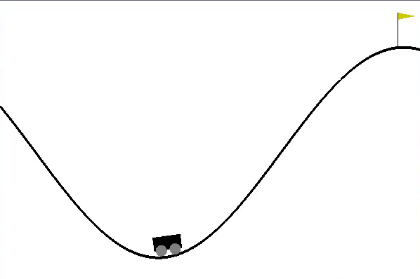

# mountainCarDDQN
Yet another Deep Q-Network in an OpenAI Gym Environment!

see my other DQN models for more detailed writeups.

[Lunar-Lander DQN](https://github.com/JustinStitt/lunarLanderDQN)

[Cartpole DQN](https://github.com/JustinStitt/cartpoleDQN)

[Acrobot DDQN](https://github.com/JustinStitt/acrobotDDQN)

## Training

**Untrained Agent**

**After 750 Epochs**

