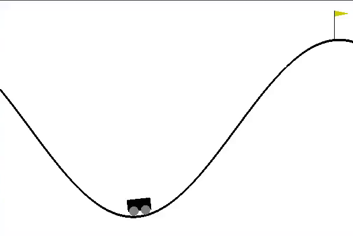

# mountainCarDDQN
Yet another Deep Q-Network in an OpenAI Gym Environment!

see my other DQN models for more detailed writeups.

[Lunar-Lander DQN](https://github.com/JustinStitt/lunarLanderDQN)

[Cartpole DQN](https://github.com/JustinStitt/cartpoleDQN)

[Acrobot DDQN](https://github.com/JustinStitt/acrobotDDQN)

## Training

**Untrained Agent**

**After 750 Epochs**

The car cannot just simply drive forward up the mountain as it does not have enough momentum.
The agent has to figure out the novel idea of going back and forth to generate enough momentum to make a final
push for the goal.